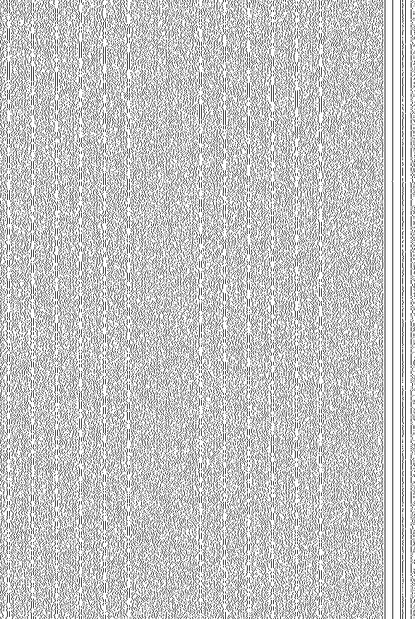

## What?
The iec-60908 standard (also known as the Red Book) describes how
[optical discs](https://en.wikipedia.org/wiki/Optical_disc) known
as [Compact discs](https://en.wikipedia.org/wiki/Compact_disc) work.
The information in this document is very abstract, and represents a
very real challenge to anyone trying to make heads or tails of how
the data is organized on the disc, and even less how to generate
said data stream.

This repository is a collection of research notes and tools, aiming
at grounding the mathematics behind all this into actionable code
and knowledge. [Disc rot](https://en.wikipedia.org/wiki/Disc_rot)
is a very real issue, and threatens preservation of our culture and
knowledge, and having better tools to not only read, but recreate
the information from such medium is a step forward in archival
efforts.

## Pits and grooves
The surface of a compact disc is covered in microscopic holes, which
form a series of pits and grooves, also known as pits and lands.
While this is well know, and the internet has lots of research showing
the surface of a compact disc through a microscope, the way this
actually translates to data isn't that well documented.

### NRZ-I encoding
The pits and grooves represent an [NRZ-I](https://en.wikipedia.org/wiki/Non-return-to-zero#Non-return-to-zero_inverted)
encoded bitstream. In layman's terms, it means that a binary '1' is
encoded by the presence of a transition from a pit to a groove, or
from a groove to a pit, whereas a binary '0' is encoded by the
absence of transition. This is important because the real bitstream
to consider while looking at the surface of a disc is the decoded
NRZ-I one. The rest of this document will mostly focus on the
bitstream after being decoded from the NRZ-I representation.

### General bitstream
The bitstream extracted from the NRZ-I decoder reading the pits and
grooves isn't exactly random. The arrangement of bits follow some
rules governed by the EFM encoding. We will be discussing the
EFM encoding a bit later, but the important aspects for this part of
the discussion are:
 - The data is organized in what's called "frames".
 - A frame is exactly 588 bits of EFM-encoded data.
 - A sector is exactly 98 frames.
 - The EFM encoding mandates the following properties:
   - Any 1 has to be followed by at least 2 zeroes.
   - Any 1 has to be followed by at most 10 zeroes.

Doing some math on this yields the following important property:
 - At 1x speed, an audio sector lasts for 1/75th of a second.
 - At 588 bits per frame, 98 frames per sector, this gives us:
   - 588 * 98 * 75 = 4321800 bits per second.

This means that the bitstream read from the disc when it's playing
at 1x speed can be seen as a 4.3218Mhz data stream. Any other
reading speed above that would simply be a multiple of the base
4.3218Mhz clock rate.

### Initial data capture
Capturing the raw bitstream with a logic analyzer hooked on the
amplifier circuit of a CD player while it is reading an audio
disc yields the following result when sampling at exactly
4.3218Mhz:

A fuller version of the above can be obtained [here](images/skewed-bitstream.png).

Several things to note there:
 - Some data patterns emerge. We will talk more about them a bit later.
 - There is only a bitstream, and no clock channel.
 - The data captured at exactly 4.3218Mhz is "wavy". This is caused
by the physical aspect of the drive, which has a motor running off a
PWM, using an internal feedback loop.
 - The DSP responsible for decoding the bistream will be the one:
   - Creating an actual clock rate to decode the input properly.
   - Managing the PWM of the motor, in order to provide an acceptable
general bitrate.
   - Buffer the decoded data so that the output rate is within
acceptable tolerances, while speeding up or slowing down the motor
accordingly.

### Clock recovery
As mentioned above, there is no clock channel, so we need to do something
to reconstitute the bitstream clock.

Due to the nature of the EFM bitstream, with not a lot of 1s separated
by a lot of 0s, at distances between 2 and 10, it is technically possible
to write a [clock recovery](https://en.wikipedia.org/wiki/Clock_recovery)
algorithm to reconstitute an appropriate clock rate.

However, this is already something that the DSP of a CD player
has to do when decoding a bitstream. It turns out that the DSP of a
[PlayStation console](https://en.wikipedia.org/wiki/PlayStation_(console))
has debugging pins with the raw NRZ-I encoded bistream, and the recovered
clock, named "ASYO" and "XPLCK" respectively:

Capturing these two signals, and processing the data to decode the bitstream
according to the recovered clock from the DSP yields a much better picture:

A fuller version of the above can be obtained [here](images/bitstream.png).
